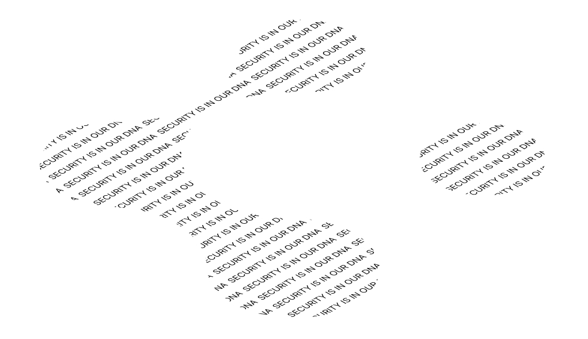

# Fuse - Web Client

## Templates/SPA

This template leverages [Remix SPA Mode](https://remix.run/docs/en/main/guides/spa-mode) to build your app as a Single-Page Application using [Client Data](https://remix.run/docs/en/main/guides/client-data) for all of your data loads and mutations.

## Deployment

This template is deployed to the following providers:

- 
- 
- 
- 
- 
- 
